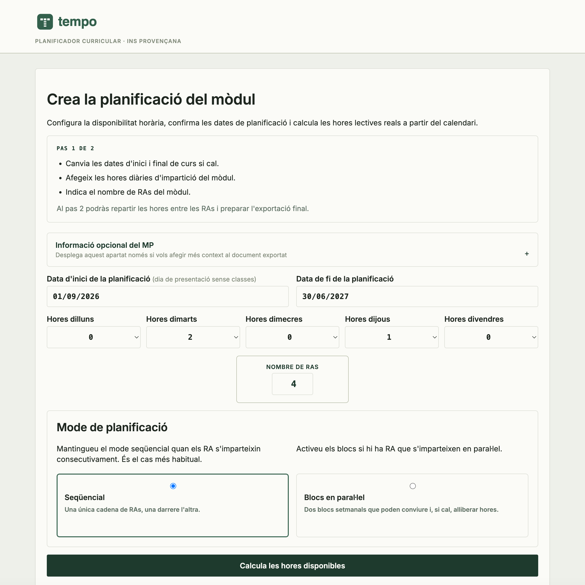
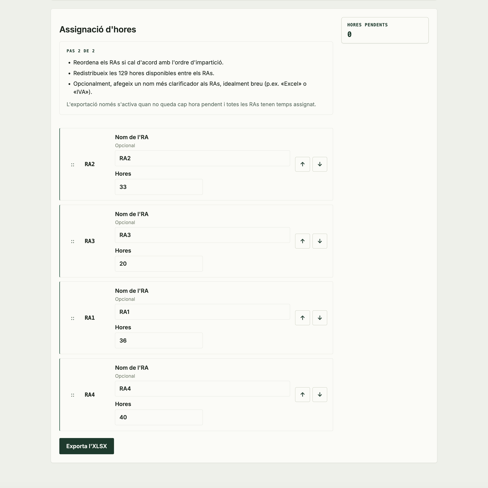
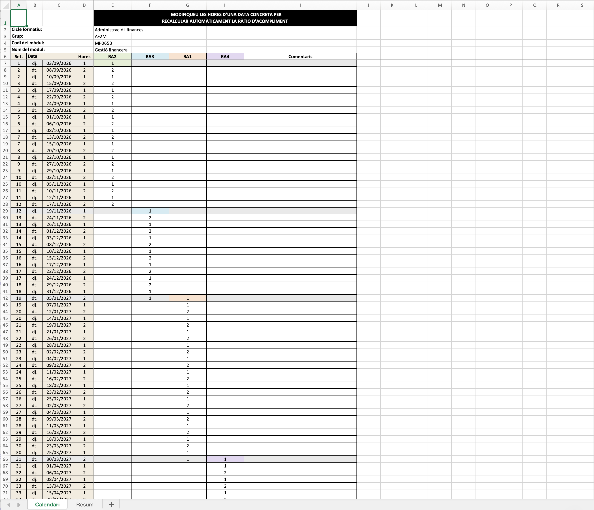
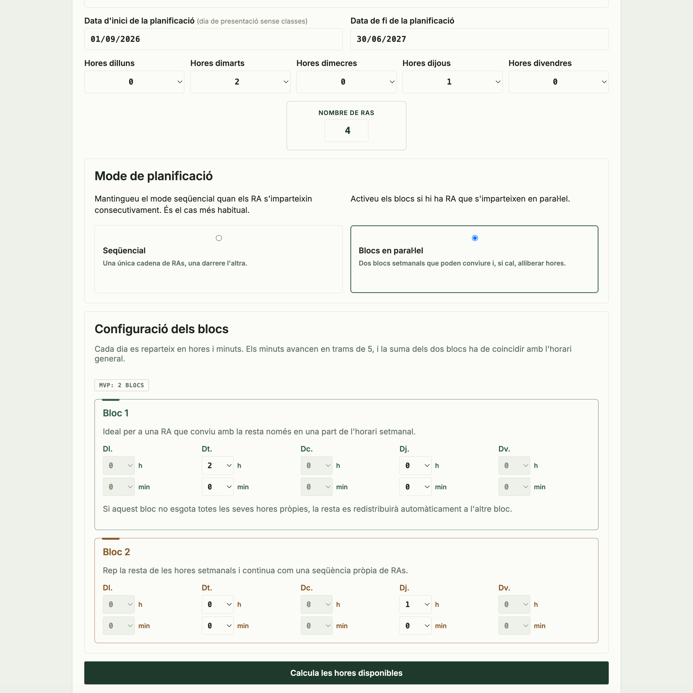
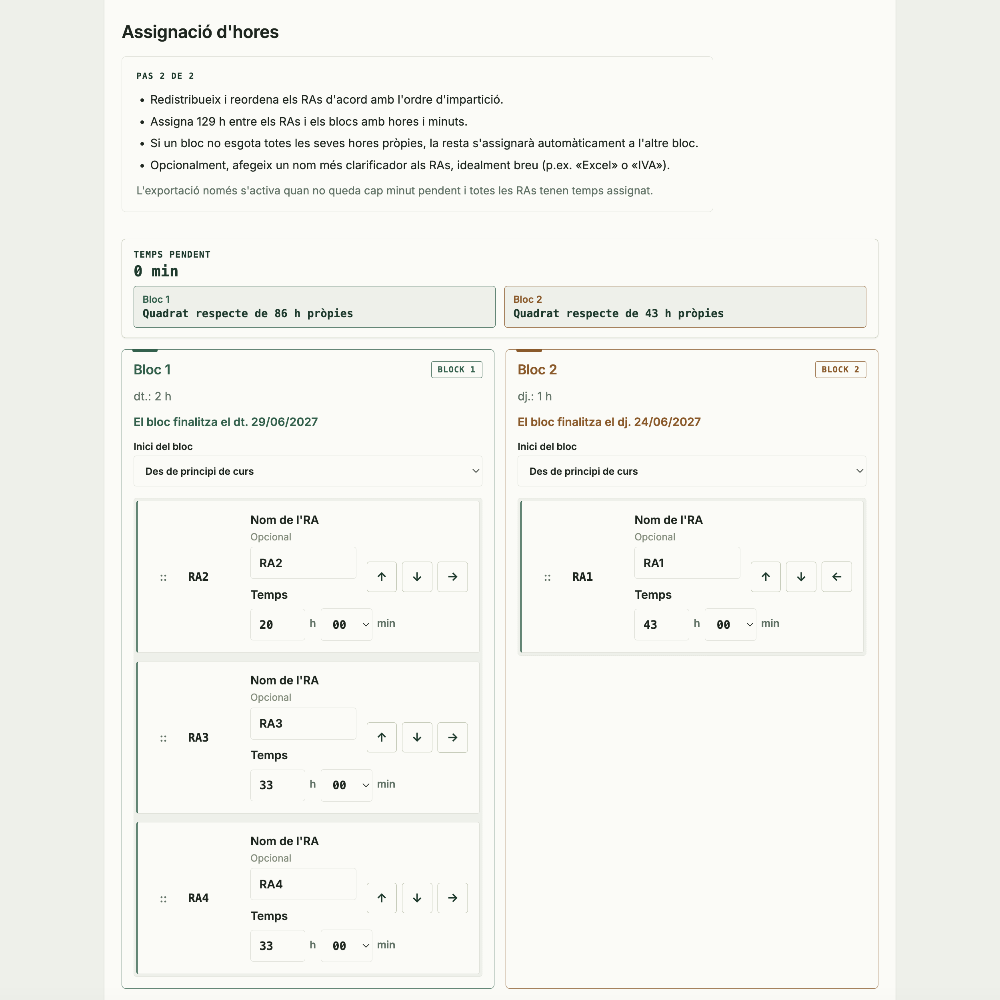

[Read this in English](README.en.md)

<p align="center">
  
</p>

<p align="center">
  <strong>Planificador curricular compacte per distribuir hores lectives, excloure dies no lectius i exportar la planificació final en XLSX.</strong>
</p>

## Tempo

Tempo és una aplicació petita basada en FastAPI pensada per ajudar centres i professorat a planificar un mòdul al llarg del curs acadèmic amb criteri i sense soroll innecessari. El projecte manté una arquitectura compacta: les regles de negoci viuen principalment a `app/services/`, les rutes HTTP a `app/routes/` i la interfície a `app/templates/`.

## Nota de desenvolupament

Aquest projecte s'ha desenvolupat amb direcció i revisió humanes, amb suport d'eines d'IA per a parts de la implementació, refactorització i documentació del flux de desplegament. Les decisions finals de producte i la responsabilitat sobre el resultat continuen recaient en el responsable del projecte.

## Què permet fer

- definir el calendari lectiu d'un mòdul a partir de dies reals de classe
- excloure períodes no lectius i dates bloquejades des de l'àrea d'administració
- repartir Resultats d'Aprenentatge en seqüència o en blocs paral·lels
- revisar la distribució abans de generar el fitxer final
- exportar la planificació en un llibre XLSX preparat per a revisió manual

## Flux visual

Tempo concentra el flux habitual en dues decisions i un resultat exportable. Les captures següents expliquen aquest recorregut amb el mode seqüencial, que és el cas més habitual.

### 1. Configura el mòdul

Defineix les dates, les hores lectives de cada dia i el nombre de RAs. Des d'aquí també es tria el mode de planificació.



### 2. Reparteix les hores disponibles

Tempo calcula les hores lectives reals, descomptant els períodes sense classe, perquè el professorat pugui ordenar els RAs, assignar-los temps i comprovar que no queda cap hora pendent abans de l'exportació.



### 3. Revisa el llibre exportat

Quan la distribució és completa, l'aplicació genera un llibre XLSX preparat per a la revisió i l'ajust manual.



### Mode per blocs en paral·lel

Quan alguns RAs s'imparteixen simultàniament, es poden dividir les hores setmanals en dos blocs independents i controlar-ne la distribució en minuts.



Al segon pas, els RAs es poden repartir, reordenar i validar dins de cada bloc abans de generar el llibre XLSX.



La pàgina d'entrada també està disponible a [docs/screenshots/tempo-step-1-landing_page.png](docs/screenshots/tempo-step-1-landing_page.png). Les captures restants, inclosa una segona vista del llibre exportat, es conserven a [docs/screenshots/](docs/screenshots/) per a documentació més detallada.

## Actius visuals

- `design/brand/` conté els actius mestres de marca i logotip
- `docs/screenshots/` conté les captures optimitzades per a documentació
- [docs/screenshots/README.md](docs/screenshots/README.md) explica el propòsit i manteniment de cada captura

## Stack

- FastAPI
- Jinja templates i JavaScript lleuger
- SQLite
- SQLAlchemy
- openpyxl
- Docker Compose

## Posada en marxa local

El fitxer `docker-compose.yml` està pensat per a desenvolupament local:

- `./app` i `./tests` es munten dins del contenidor
- Uvicorn s'executa amb `--reload`
- la base de dades SQLite es conserva a `./data/app.db`

Passos:

1. Copia `.env.example` a un `.env` propi si vols personalitzar valors.
2. Inicia l'aplicació:

```bash
docker compose up --build
```

3. Obre `http://localhost:8000`
4. El flux de professorat és a `/`
5. L'àrea d'administració és a `/admin`

Si el port `8000` està ocupat:

```bash
HOST_PORT=10080 docker compose up --build
```

## Desplegament tipus producció

Per a una execució sense bind mounts ni `--reload`, fes servir `docker-compose.production.yml`.

```bash
ENV_FILE=/absolute/path/to/.env.prod DATA_DIR=/absolute/path/to/data HOST_PORT=8091 docker compose -f docker-compose.production.yml up -d --build
```

També hi ha l'script del repositori:

```bash
ENV_FILE=/absolute/path/to/.env.prod DATA_DIR=/absolute/path/to/data HOST_PORT=8091 bash scripts/deploy_production.sh
```

Per a una previsualització de branca:

```bash
bash scripts/deploy_preview.sh
```

## Flux de l'aplicació

### Professorat

- `/` mostra el formulari inicial de configuració del mòdul
- `/plan` permet ordenar, repartir i validar els RAs abans d'exportar
- l'exportació final es fa cap a un llibre XLSX

### Administració

- `/admin` està protegit per autenticació
- permet gestionar anys acadèmics i dates excloses
- no apareix enllaçat des de la interfície pública

## Variables d'entorn principals

- `APP_NAME`: nom principal visible a la interfície
- `SCHOOL_NAME`: sufix opcional al títol i capçalera
- `SECRET_KEY`: secret de signatura de sessió
- `ADMIN_USERNAME`: usuari d'administració
- `ADMIN_PASSWORD`: contrasenya d'administració
- `DATABASE_URL`: URL de connexió SQLAlchemy
- `WEB_CONCURRENCY`: nombre de processos del servidor en execució tipus producció

## Proves

Per executar la suite principal:

```bash
docker compose run --rm web pytest
```

Per executar les proves focalitzades de serveis:

```bash
pytest tests/test_services.py
```

## Estructura del projecte

```text
app/
  routes/
  services/
  static/
  templates/
design/
  brand/
docs/
  screenshots/
scripts/
tests/
README.md
README.en.md
```

## Recursos de marca i disseny

- `design/tempo-design-system.md`: referència canònica del sistema visual
- `design/brand/README.md`: ús correcte dels logos i variants
- `app/static/img/`: subconjunt de logos servits per l'aplicació

## Llicència

Aquest projecte està llicenciat sota `AGPL-3.0-only`. Consulta [LICENSE](LICENSE).
